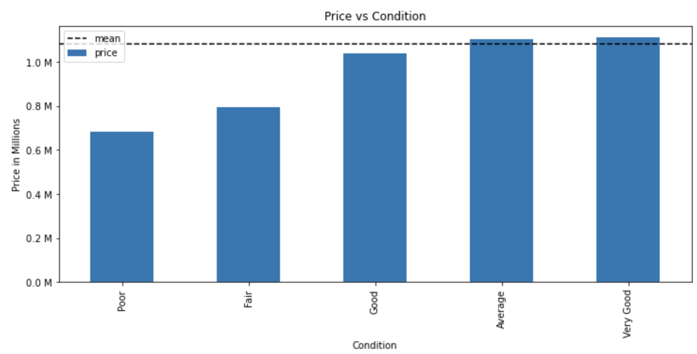

# Home Renovation Analysis

**Author**: [Michael Tsypin](email:mtsypin9@yahoo.com)

## Overview

The purpose of this project is to create a model that helps homeowners and real estate agencies highlight the key components to add profitability when selling their homes. Using multiple linear regression, we will analyze data from the King County House Sales dataset and examine how renovating different components of a hoke will impact overall sales.

## Business Problem

A real estate agency has asked for help regarding how they can increase profitability in selling their homes. Using data from the King County House Sales dataset, we will examine different components of the home, and how renovating them will change the overall price of the home. Due to fluctuations in the housing market, this information is useful for homeowners and real estate agencies in order to maximize their home sales profits.

## Data and Methods

Data of over 30,000 homes from the King County House Sales dataset. Multiple linear regression is utilized to determine the best renovations for homes. The variables we will focus on are square footage of living area, square footage of patio, and overall condition of the home.

## Results

For every 1% increase in square footage of the living area, we would expect an associated increase of 0.0004% in price


For every 1% increase in square footage of the patio, we would expect an associated increase of 0.0002% in price


For a house of Fair condition compared to a house of poor condition, we see an associated increase in price of about 24%. For a house of Average condition compared to a house of poor condition, we see an associated increase in price of about 34%. For a house of good condition compared to a house of poor condition, we see an associated increase in price of about 35%. For a house of very good condition compared to a house of poor condition, we see an associated increase in price of about 42%.



## Conclusion

In this project, we found that improving the overall condition of the house adds the most value when selling a home. For example, ensuring all maintenance is up to par and the exterior is in good condition. Adding square footage to the patio and living area also helps increase the value of the home, but the overall condition of the home should be prioritized.

## For More Information

See the full analysis in the [Jupyter Notebook](home_renovation_analysis.ipynb) or review [Presentation](home_renovation_presentation.pdf)

## Repository Structure

```
├── data
├── images
├── .gitignore
├── README.md
├── home_renovation_analysis
└── home_renovation_presentation
```
